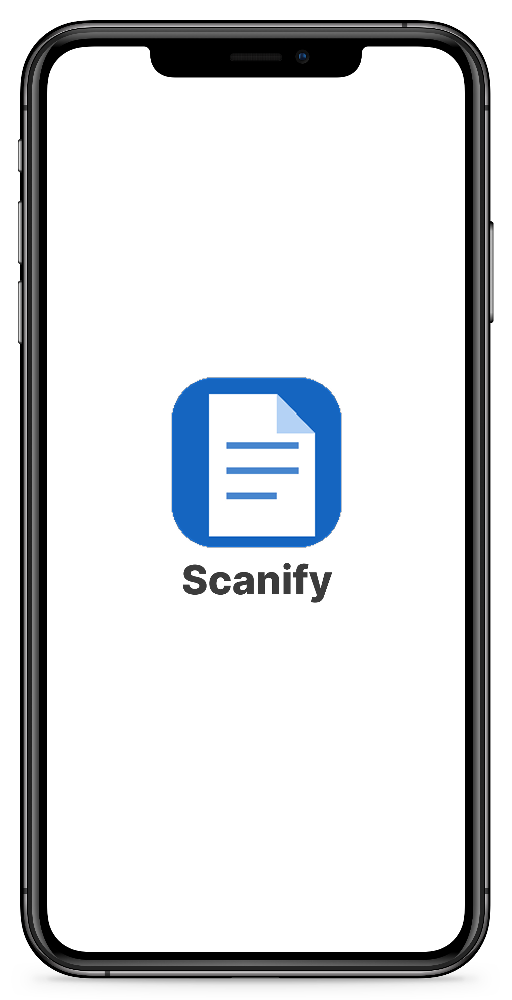
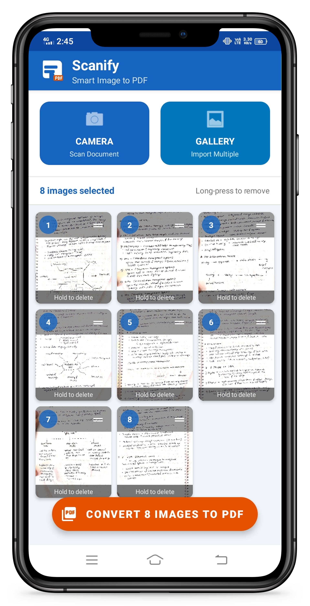

<div align="center">


## **Scan · Convert · Share**

*A native Android app that converts images into professional PDF documents - no internet, no bloat, no BS.*


-blue?style=flat-square)


</div>


## 💡Why I Built This

I was tired of scanning assignment sheets with third-party apps that shove ads in your face, upload your files to some random server, or lock basic features behind a paywall. All I wanted was: **take photo → get PDF**. That's it.

So I built Scanify a clean, offline, zero-dependency scanner that does exactly that. No accounts. No cloud. No nonsense. Just your images turned into a proper PDF, saved locally, ready to share wherever you want.

This is also my first real Android project beyond tutorials, and it's still actively being built. I'm learning a lot along the way the `PdfDocument` API, RecyclerView touch mechanics, scoped storage changes across API levels, and what it actually takes to go from a working prototype to something polished. The core flow works; the rest is being shaped as I go.


## 🔍 What It Does

**Select** images from your gallery or capture them live with the camera. **Arrange** them in any order using drag-and-drop. **Generate** a properly scaled A4 PDF. **Share** it anywhere WhatsApp, Gmail, Drive, Teams, you name it.

That's the whole flow. No sign-in. Fully offline.


## ✨ Features

### Image Input
- Import multiple images from the device gallery
- Capture directly via camera
- Fast image loading with native Android APIs

### Pre-Conversion Controls
- Grid preview of all selected images before conversion
- Drag-and-drop page reordering via `ItemTouchHelper`
- Long-press to remove individual images

### PDF Generation
- Powered by Android's native `PdfDocument` API - zero external PDF libraries
- Automatic A4 scaling and page alignment
- Runs entirely on-device; no network calls, no uploads

### Output & Sharing
- Custom filename before saving
- Saved to device storage via `MediaStore` API
- Share to Gmail, WhatsApp, Telegram, Google Drive, Microsoft Teams, or any compatible app via `FileProvider`


## ⚙️ Tech Stack

| Layer | Technology | Role |
|---|---|---|
| Language | Java | Core application logic |
| UI | XML + Material Design Components | Layouts and interface |
| List | `RecyclerView` + `GridLayoutManager` | Image preview grid |
| Reordering | `ItemTouchHelper` | Drag-and-drop page ordering |
| PDF Engine | `PdfDocument` API | Native PDF generation |
| File Sharing | `FileProvider` | Secure URI-based file sharing |
| Storage | `MediaStore` API | Writing PDFs to device storage |

> Everything here is stock Android - no third-party PDF libraries, no image-processing SDKs. Part of the challenge was figuring out how much you can do with just the platform.


## 📱  Screenshots

<div align="center">

| Startup | Select Images | Arrange & Generate |
|:---:|:---:|:---:|
|  |  |  |

| PDF Conversion | Result Screen | |
|:---:|:---:|:---:|
|  |  | |

</div>


## 📂 Project Structure

```
Scanify/
├── app/
│   └── src/
│       └── main/
│           ├── java/               # Application source code
│           ├── res/                # Layouts, drawables, strings
│           └── AndroidManifest.xml
├── ScreenShots/                    # App preview images
├── README.md
└── LICENSE
```


## 🔐 Permissions

The app requests only what it actually needs, and respects Android's evolving storage permission model across API levels.

| Permission | Target | Purpose |
|---|---|---|
| `CAMERA` | All versions | Capture images directly in-app |
| `READ_MEDIA_IMAGES` | Android 13+ | Gallery access (scoped) |
| `READ_EXTERNAL_STORAGE` | Android ≤ 12 | Gallery access |
| `WRITE_EXTERNAL_STORAGE` | Android ≤ 9 | Save PDF to external storage |


## 🚀 Getting Started

**Clone the repo**

```bash
git clone https://github.com/Sanchet237/Scanify.git
```

**Open in Android Studio**

1. Launch Android Studio (Hedgehog or newer)
2. Go to **File → Open** and select the cloned directory
3. Wait for Gradle sync to finish
4. Hit Run on an emulator or physical device (API 21+)

**Requirements**

- Android Studio Hedgehog+
- Android SDK 21+
- Java 8+


## 🎯 Current Status & Roadmap

Scanify is under **active development**. The core pipeline — select, arrange, convert, share — is functional. Everything below is what's being worked on or planned next.

**In Progress**
- [ ] Stabilizing edge cases in image scaling across different aspect ratios
- [ ] Improving the result screen UX

**Planned**
- [ ] Dark Mode *(the UI is begging for it)*
- [ ] OCR Text Recognition *(make PDFs searchable)*
- [ ] PDF Compression *(useful for large photo sets)*
- [ ] PDF Password Protection
- [ ] Merge / Split PDFs
- [ ] Watermark Support
- [ ] Cloud Backup integration
- [ ] Multi-language Support

This list will evolve as the project grows. If you have ideas or spot a bug, feel free to open an issue — feedback during active development is genuinely useful.


## 👨‍💻 Author

<div align="center">


Made with ❤️ by <a href="https://github.com/Sanchet237"><strong>Sanchet Kolekar</strong></a>

*If Scanify saved you from a sketchy scanner app, a ⭐ goes a long way.*
<br/>

[](https://github.com/Sanchet237)
[](https://www.linkedin.com/in/sanchet-kolekar-613916331/)
[](https://www.instagram.com/sanchetkolekar)
[](https://x.com/Sanchet_237)
[](mailto:sanchetkolekar.07@gmail.com)

<br/>


</div>